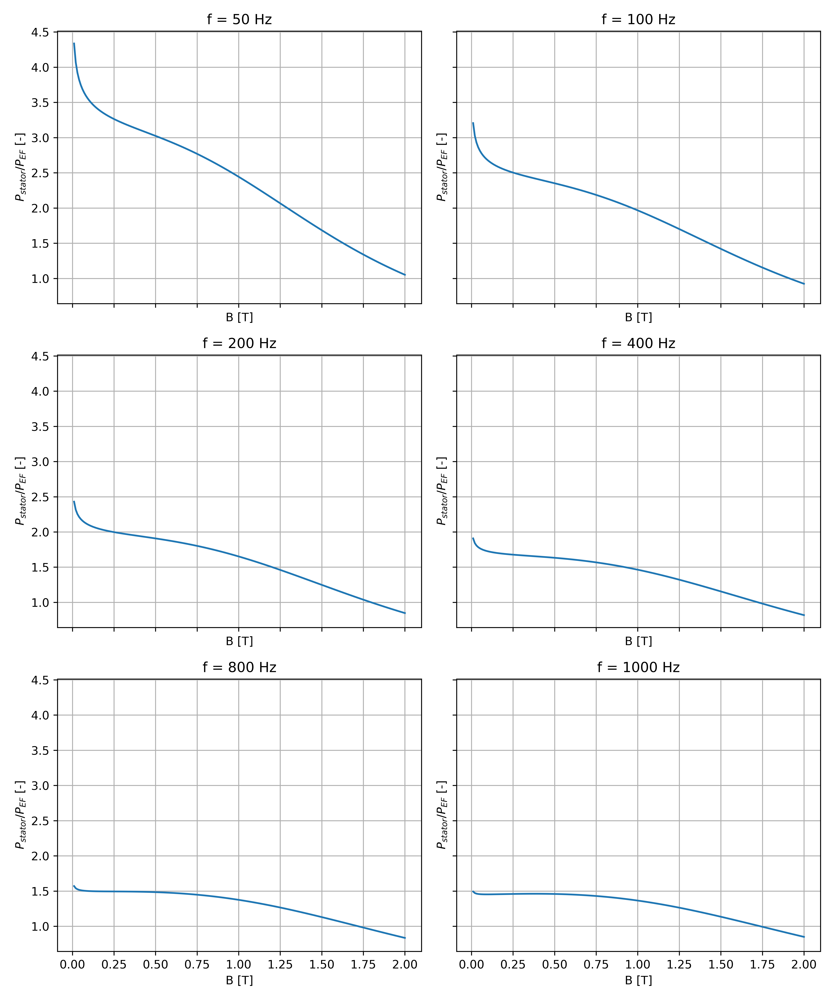
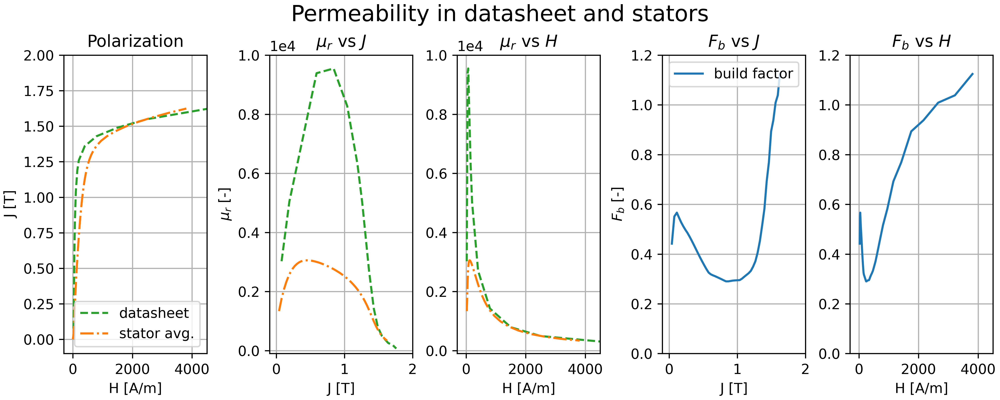
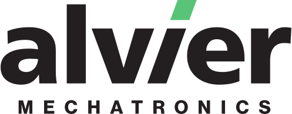

# statordata
Data and parameter optimization for loss models on NO20 stators, a drawing of the [stator geometry](figures/eps/stator_drawing.eps). Photograps of the built stators are in the folder photographs.

The permeability and loss data are provided in the LAMS folder, here we also provide the [pdf datasheet](LAMS/tata-steel-hi-lite-electrical-steel-no20-1200h-datasheet-en.pdf), and the digitized versions of the [permeability excel file](LAMS/no20-1200h_peak_magnetic_polarisation.xlsx) and [loss data excel file](LAMS/hiliteno20-1200H.xlsx) from the datasheet.

Fitting the 6 parameter loss model on the data is performed with https://pymoo.org/algorithms/soo/cmaes.html, see the notebook [opt.ipynb](opt.ipynb).

## Generating figures

the notebooks [opt.ipynb](opt.ipynb) and [permeability.ipynb](permeability.ipynb) generate the fits and the base figures.
For combining the fit figure, run: 
```bash
$ python3 combinesvgs.py figures/svg/datasheet.svg figures/svg/stator.svg figures/svg/combined.svg --gap 24 --eps figures/eps/combined.eps
```

## Results
The resulting build factors can be seen below






## Acknowledgement


The stators, testing, and writing of this paper were supported by [Alvier Mechatronics](https://www.alviermechatronics.com/).
For similar data or for development of new machines with accurately captured simulation losses, please contact Alvier Mechatronics via their website.